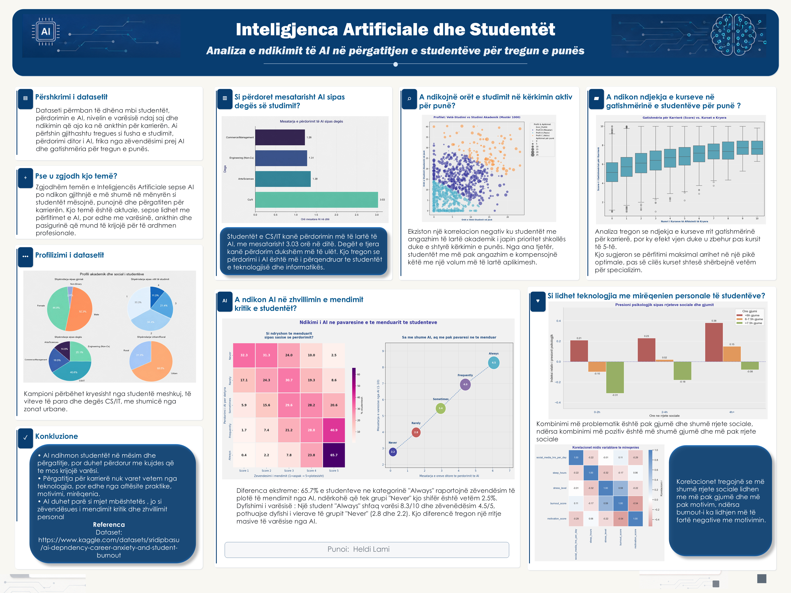

# Student AI Dependency & Career Anxiety — Analysis

An end-to-end data analysis project exploring how AI tool usage affects academic independence, career anxiety, and professional readiness among students.

Built with **Python (pandas, matplotlib, seaborn)** on a dataset of **15,000 students** and **30 features**.

---

## Research Questions

- Does heavier AI usage reduce students' independent thinking?
- Is there a correlation between AI dependency and career/placement anxiety?
- Do study habits and course completion relate to career readiness?
- Which student profiles are most likely to rely on AI?

---

## Project Structure

```
student-ai-dependency-analysis/
│
├── data/
│   ├── raw/
│   │   ├── ai_dependency_career_anxiety_students.csv   # Original dataset (15,000 rows, 30 cols)
│   │   └── feature_dictionary.csv                      # Column definitions and data types
│   └── clean/
│       └── ai_students_clean.csv                       # Cleaned dataset (output of ETL)
│
├── src/
│   ├── ETL/
│   │   └── clean_raw.py                                # Full ETL pipeline (standalone script)
│   ├── ai_influence_thinking/
│   │   └── ai_influence_thinking.py                    # AI influence heatmap + bubble chart
│   └── notebook.ipynb                                  # Main analysis notebook (69 cells)
│
└── graphs/                                             # All exported visualizations
    ├── 01_01_profili_studenteve_4_piecharts.png
    ├── 01_02_mjetet_ai_me_te_perdorura.png
    ├── 01_03_oret_ai_sipas_detyrave.png
    ├── 01_04_ai_sipas_deges.png
    ├── 02_01_ai_influence_chart.png
    ├── 03_01_korrelacioni_ankthi_ai.png
    ├── 03_02_ankthi_vs_ai.png
    ├── 03_03_study_hours_job_applications.png
    └── 03_04_courses_career_readiness.png
```

---

## Dataset

| Property        | Value                                         |
| --------------- | --------------------------------------------- |
| Source          | `ai_dependency_career_anxiety_students.csv` |
| Rows            | 15,000 students                               |
| Columns         | 30 features                                   |
| Target variable | `overall_career_readiness_score` (1–10)    |

### Key Features

| Column                             | Type          | Description                                  |
| ---------------------------------- | ------------- | -------------------------------------------- |
| `daily_ai_tool_usage_hrs`        | float         | Average daily hours using generative AI      |
| `uses_ai_for_assignments`        | categorical   | Frequency: Never → Always                   |
| `ai_dependency_score`            | int (1–10)   | Composite behavioral reliance score          |
| `ai_replaces_own_thinking_score` | int (1–5)    | Self-reported critical thinking displacement |
| `placement_anxiety_score`        | int (1–10)   | Anxiety about post-graduation employment     |
| `fear_of_job_loss_to_ai`         | int (1–5)    | Concern about automation                     |
| `career_clarity_score`           | int (1–10)   | Clarity of personal career trajectory        |
| `overall_career_readiness_score` | float (1–10) | **Target variable**                    |

Full column definitions are in [`data/raw/feature_dictionary.csv`](data/raw/feature_dictionary.csv).

---

## ETL Pipeline (`src/ETL/clean_raw.py`)

The cleaning pipeline runs seven sequential steps:

| Step | Function                   | What it does                                                                                          |
| ---- | -------------------------- | ----------------------------------------------------------------------------------------------------- |
| 1    | `load_dataset`           | Reads raw CSV, prints shape and dtypes                                                                |
| 2    | `column_standardization` | Lowercases column names, replaces spaces with `_`                                                   |
| 3    | `optimization_fix_type`  | Casts categoricals, booleans; calls `convert_dtypes()`                                              |
| 4    | `null_handling`          | Fills missing values:`Unknown` for AI tools, median for hour columns, `False` for counseling flag |
| 5    | `remove_duplicates`      | Drops exact duplicates and duplicate `student_id` rows                                              |
| 6    | `outliers_check`         | IQR-based clipping on 6 numeric columns                                                               |
| 7    | `text_standardization`   | Strips whitespace, applies `.title()`, fixes `ChatGPT`/`GitHub Copilot` casing                  |

### Run the ETL

```bash
# From the project root
python src/ETL/clean_raw.py
# Output: data/clean/ai_students_clean.csv
```

---

## Notebook (`src/notebook.ipynb`)

The main analysis notebook (69 cells) covers the full workflow in sections:

**Section 1 — Student Profile**

- Demographics breakdown (gender, degree type, field of study, college tier)
- Most used AI tools
- AI usage hours by task type
- AI usage by academic discipline

**Section 2 — AI Influence on Thinking**

- Heatmap: AI usage frequency vs. thinking replacement score
- Bubble chart: daily AI hours → dependency score → thinking displacement (three-variable view)

**Section 3 — Career Anxiety & Readiness**

- Correlation matrix: anxiety scores vs. AI dependency
- Scatter: placement anxiety vs. AI usage
- Study hours and job application behavior
- Skill development courses vs. career readiness score

### Run the notebook

```bash
pip install jupyter pandas matplotlib seaborn numpy
jupyter notebook src/notebook.ipynb
```

---

## Visualizations

All graphs are pre-exported to `graphs/` at 160 DPI.

| File                                         | Content                                        |
| -------------------------------------------- | ---------------------------------------------- |
| `01_01_profili_studenteve_4_piecharts.png` | 4-panel pie: gender, degree, tier, urban/rural |
| `01_02_mjetet_ai_me_te_perdorura.png`      | Most used AI tools                             |
| `01_03_oret_ai_sipas_detyrave.png`         | AI hours by task type                          |
| `01_04_ai_sipas_deges.png`                 | AI usage by academic field                     |
| `02_01_ai_influence_chart.png`             | Heatmap + bubble chart (AI → thinking)        |
| `03_01_korrelacioni_ankthi_ai.png`         | Correlation matrix                             |
| `03_02_ankthi_vs_ai.png`                   | Placement anxiety vs AI usage                  |
| `03_03_study_hours_job_applications.png`   | Study habits vs job applications               |
| `03_04_courses_career_readiness.png`       | Courses taken vs career readiness              |

---

## Poster



## Requirements

```
pandas
numpy
matplotlib
seaborn
jupyter
```

Install all at once:

```bash
pip install pandas numpy matplotlib seaborn jupyter
```
